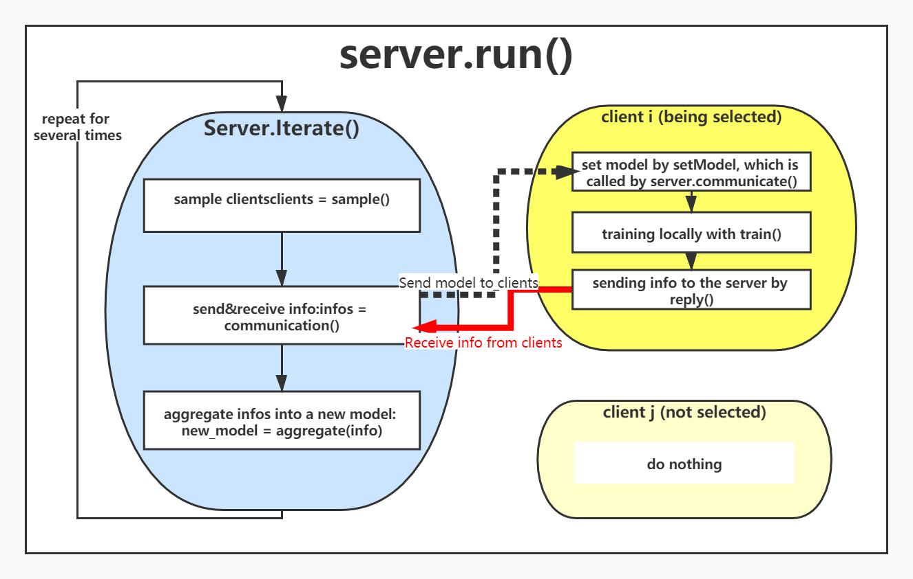

# Federated Learning with Fair Averaging 
This repository is an implementation of the fair federated algorithm discussed in
```
    Zheng Wang, Xiaoliang Fan, Jianzhong Qi, Chenglu Wen, Cheng Wang and Rongshan Yu
    Federated Learning with Fair Averaging (ijcai-2021), 
    Apr. 30, 2021. 
    https://arxiv.org/abs/2104.14937
```
And everyone can use this experimental platform to quickly realize and compare popular centralized federated learning algorithms.

## Abstract
 Fairness has emerged as a critical problem in federated learning (FL). In this work, we identify a cause of unfairness in FL -- *conflicting* gradients with large differences in the magnitudes. To address this issue, we propose the federated fair averaging (FedFV) algorithm to mitigate potential conflicts among clients before averaging their gradients. We first use the cosine similarity to detect gradient conflicts, and then iteratively eliminate such conflicts by modifying both the direction and the magnitude of the gradients. We further show the theoretical foundation of FedFV to mitigate the issue conflicting gradients and converge to Pareto stationary solutions. Extensive  experiments on a suite of federated datasets confirm that FedFV compares favorably against state-of-the-art methods in terms of fairness, accuracy and efficiency.


## Setup
Requirements:
```
pytorch=1.3.1
torchvision=0.4.2
cvxopt=1.2.0 (is required for fedmgda+)
```
## Quick Start
Try to run the cmd to quickly get a result of the basic algorithm FedAvg on the mnist.  
```
python main.py --method fedavg --dataset mnist --model cnn --num_rounds 20
```
The result will be stored in ./task/mnist/record/.
### Options
Basic Settings:
* `dataset` is the benchmark and there are three datasets including 'cifar10', 'mnist' and 'femnist'.
* `model` should be the corresponding model of the dataset and is defined under the path ./task/dataset_name/model_name.py.
* `method` is to choose the FL algorithm to run the experiments. Each method is realized in ./method/method_name.py.
Options in server-side:
* `sample` decides the way to sample clients in each round('uniform' means uniformly/'prob' means choosing with probility)
* `aggregate` decides the way to aggregate clients' model. The details are in ./method/fedbase.BaseServer.aggregate.
* `num_rounds` is the number of communication rounds.
* `proportion` is the proportion of clients to be selected in each round.
Options in client-side:
* `num_epochs` is the number of local training epochs.
* `learning_rate` is the step size when locally training.
* `batch_size` is the size of one batch data during local training. 
* `optimizer` chosen from 'SGD'|'Adam'.
* `momentum` is the ratio of the momentum item when the optimizer SGD taking each step.
Other settings:
* `seed` is for random initialization.
* `gpu` is the number of the device.
* `eval_interval` controls the interval between every two evaluations.
Additional hyper-parameters(etc. alpha,tau for fedfv)
* Each additional parameter can be defined easily in ./utils/tools.read_option 
## Usages
We seperate the FL system into mainly three parts: `method`, `task` and `utils`.
### Method
:------------------:|
|
#### Server
Each method contains two classes: the `Server` and the `Client`. 
The whole FL system starts with the `main.py`, which runs `server.run()` after initialization. Then the server repeatedly performs the method `iterate()` for `num_rounds` times, which represents each communication round. In the `iterate()`, the BaseServer firstly selects some clients by the method `select()`, and then sends and receives the privacy-preserving infomation through the method `communicate()`, and finally aggregate the models updated by clients with into the new model `aggregate()`. Therefore, anyone who wants to diy its own method that specifies some operations on the server-side should rewrite the method `iterate()` and methods called by it.
#### Client
The clients reponse to the server after the server `communicate` with them, and then train the model with its local dataset by the method `train()`., which can be changed as need. After training the model, the clients can send anything(e.g. loss, gradient,... ) to the server through the method `reply()`.     
### Task
We define each task as a combination of the `dataset`, the coresponding model, and the basic loss function. The raw dataset is processed into .json file, following LEAF(). The architechture of the .json file is decribed as below:

Since the task-specified models are usually orthogonal to the FL algorithms, we don't consider it an important part in this system. And the model and the basic loss function are defined in ./task/dataset_name/model_name.py.
### utils
This module is for the initialization and outputting the results.


